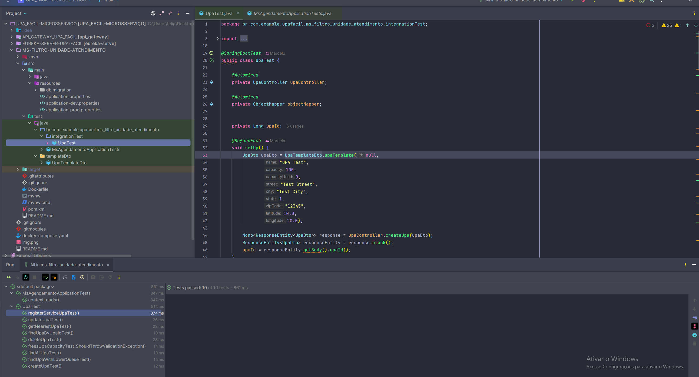
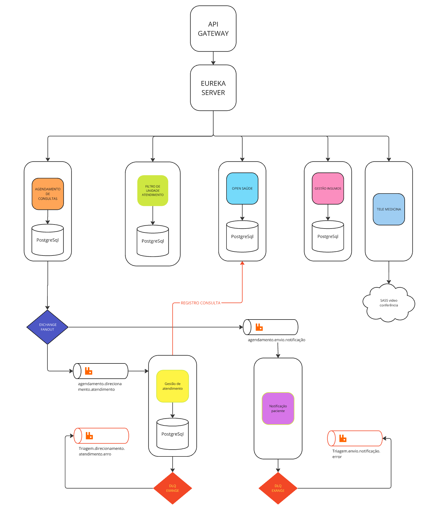

<div align="center">
<a href="https://www.fiap.com.br" target="_blank">
    
</a>

[](https://docs.oracle.com/en/java/javase/11)
[](https://docs.spring.io/spring-boot/docs/current/reference/htmlsingle)
[](https://www.docker.com)
[](https://www.postgresql.org/)
</div>

___
# TRABALHO DE CONCLUSÃO - FASE 5

# 📌 UPA FÁCIL
A projeto tem como principal objetivo facilitar o direcionamento de pacientes para a
Unidade de Pronto Atendimento (UPA) mais próxima e com menor tempo de espera. 
Com essa API, é possível acompanhar em tempo real a fila de atendimento das UPAs, 
registrar e liberar atendimentos, além de consultar as unidades disponíveis.
___
# 📝 Summary
Nesse documento iremos abordar os seguintes temas

* [🛠️ Executando o projeto](#-executando-o-projeto)
  * [🛠️ Executando o projeto (Sem Docker)](#-executando-o-projeto-sem-docker)
  * [🛠️ Executando o projeto (Com Docker)](#-executando-o-projeto-com-docker)
* [📝 Documentação do Software](#-documentação-do-software)
  * [🚀 Funcionalidades](#-funcionalidades)
  * [🔗 Endpoints Principais](#-endpoints-principais)
  * [📦 Tecnologias Utilizadas](#-tecnologias-utilizadas)
  * [📄 Documentação Swagger](#-documentação-swagger)
  * [📂 Insomnia Collection](#-insomnia-collection)
  * [🏛️ Arquitetura de Software](#️-arquitetura-de-software)
  * [🧾 Testes Automatizados](#testes-automatizados)
  * [📽️ Video de Funcionamento do Software](#️video-de-funcionamento-do-software)
* [🎯Concepção do MVP](#-concepção-do-mvp)
  * [🧾 Desafio Proposto](#-desafio-proposto)
  * [⭐ Estratégia de Concepção](#-estratégia-de-concepção)
    * [🤔 Design Thinking](#-design-thinking)
    * [🧠 Brainstorming](#-brainstorming)
    * [🎯 Definição MVP](#-definição-mvp)
  * [📽️ Video de Apresentações do Pitch e MVP](#️-video-de-apresentações-do-pitch-e-mvp)
* [🐾 Proximos Passos](#-proximos-passos)
  * [🐾 Curto Prazo](#-curto-prazo)
  * [🐾 Longo Prazo](#-longo-prazo)
  * [🧾 Arquitetura Completa do Sistema](#arquitetura-completa-do-sistema)
* [📝 Licença](#-licença)
* [👨‍💻 Integrantes](#-integrantes)
___
# 🛠️ Executando o projeto

## 🛠️ Executando o projeto (Sem Docker)

**Pré Requisitos**
- Maven 3.9.6
- Java 21
- PostgreSQL 17.4

**Passo a Passo**
1. Clone este repositório:
   ```bash
   git clone --recurse-submodules https://github.com/Felipewiiu/UPA_FACIL-MICROSSERVICO.git
   ```
2. Configure as variáveis de ambiente no arquivo `.env` ou `application.properties`.<br></br>
3. Troque o ``application.properties`` para perfil de ``[dev]``<br></br>
4. Execute a aplicação com o Maven:
   ```bash
   mvn spring-boot:run
   ```

## 🛠️ Executando o projeto (Com Docker)

**Pré Requisitos**
- Docker

**Passo a Passo**
1. Clone este repositório:
   ```bash
   git clone --recurse-submodules https://github.com/Felipewiiu/UPA_FACIL-MICROSSERVICO.git
   ```
2. Entre na raíz do microserviço e digite
    ````shell
    docker-compose up --build
    ````
___
# 📝 Documentação do Software

## 🚀 Funcionalidades

- 🔍 **Localizar a UPA mais próxima do paciente**
- 📉 **Identificar a UPA com menor fila de atendimento**
- 🏥 **Gerenciar UPA (Cadastro, Atualização e Remoção)**
- ⏳ **Monitorar o fluxo de atendimento em tempo real**

## 🔗 Endpoints Principais

### 📊 Monitoramento e Fila de Atendimento

- `GET /upa/real-time-queue` → Acompanha a fila de atendimento em tempo real
- `GET /upa/lower-queue/state/{state}` → Retorna a UPA com menor fila de atendimento
- `GET /upa/near-upa` → Retorna a UPAs mais próxima do paciente segundo a sua localização
- `GET /upa/register-service/{upaId}` → Adiciona paciente na fila de atendimento
- `GET /upa/frees-queue/{upaId}` → Retira paciente da fila de atendimento

### 📌 Gestão de UPAs

- `POST /upa/create` → Cadastra uma nova UPA
- `GET /upa/{id}` → Busca uma UPA pelo ID
- `GET /upa/all` → Retorna todas as UPAs disponíveis
- `PATCH /upa/update/{id}` → Atualiza informações da UPA
- `DELETE /upa/delete/{id}` → Remove uma UPA do sistema

## 📦 Tecnologias Utilizadas

- Java com Spring Boot
- Banco de Dados PostgreSQL
- MapStruct (Mapeamento de entidades)
- Clean Architecture
- Webflux
- SSE - Server Sent Events
- Docker
- Flyway para controle de migrações
- Swagger
- Spring Cloud Netflix
- Algoritimo de Haversine (Cálculo de distâncias entre coordenadas)


## 📄 Documentação Swagger
- Acesse a documentação da API via Swagger:
  `http://localhost:<PORTA>/swagger-ui/webjars/swagger-ui/index.html`

## 📂 Insomnia Collection:
- Importe a collection localizada na pasta dcos na raiz do projeto: `Insomnia_Upa_Facil.json`

## 🏛️ Arquitetura de Software
- O software foi desenvolvido utilizando a arquitetura  Clean Architecture, que visa a separação de
  responsabilidades e a manutenção de um código limpo e organizado.

  

## 🧾 Testes Automatizados
- O software foi desenvolvido utilizando testes de integração e unitários, garantindo a qualidade do código e a
  integridade das funcionalidades. Segue abaixo o resultado dos testes:

  

## 📽️Video de Funcionamento do Software
- Para facilitar e melhor entendimento do software, assista ao vídeo de funcionamento do MVP clicando no link abaixo:

   [](https://youtu.be/a5NJLaKyyA8?si=yuzmc0o2dvR_ad2J)
___
# 🎯Concepção do MVP
Nesta seção, abordamos o processo de concepção do MVP, desde a definição do desafio até a validação da ideia com usuários reais.

## 🧾 Desafio Proposto
`“Inovação para otimização de atendimento no SUS (Sistema Único de Saúde)”`

O objetivo é desenvolver sistemas, ferramentas ou plataformas tecnológicas que
facilitem e melhorem o atendimento à população, bem como o trabalho dos 
profissionais de saúde, por meio de soluções que aumentem a eficiência, promovam 
a transparência e contribuam para uma melhor experiência de pacientes e colaboradores do SUS

## ⭐ Estratégia de Concepção
Como estratégia de concepção, utilizamos o Design Thinking para entender 
as necessidades dos usuários e criar uma solução centrada no usuário. Além disso,
realizamos brainstorming para gerar ideias inovadoras e prototipação para testar

### 🤔 Design Thinking
O processo de Design Thinking foi utilizado para compreender melhor as necessidades dos usuários 
e criar uma solução centrada no usuário. As etapas abordadas incluem:

#### 1. **Empatia** (Entendimento profundo das dores e necessidades dos usuários)
- Devido a proximidade de dois desenvolvedores com o ramo de saúde, foi possível realizar entrevistas com pacientes e profissionais de saúde para entender as dificuldades enfrentadas no atendimento.
- Conseguimos entrevistar 5 profissionais da saúde, sendo 2 médicos, 2 enfermeiros e 1 atendente de UPA. E 3 pacientes que frequentam UPAs com frequência.
#### 2. **Definição** - Identificação do problema central a ser resolvido.
- Foram identificados diversos problemas, mas focamos na dor do paciente
- O problema central identificado foi a falta de informações em tempo real sobre a fila de atendimento nas UPAs e
dificuldade de localização da UPA mais perta em momento de urgência.
#### 3. **Ideação** - Geração de ideias inovadoras para solucionar o problema.
- Foram geradas diversas ideias, mas optamos por criar um sistema que permitisse ao paciente localizar a UPA mais próxima e com menor fila de atendimento.
#### 4. **Prototipação** - Criação de um MVP inicial para testar as hipóteses levantadas.
- Foi criado um MVP inicial para testar a ideia de localização de UPAs e monitoramento da fila de atendimento, utilizando o FIGMA para prototipagem
#### 5. **Testes** - Validação do MVP com usuários reais e ajustes conforme feedback.
- Embora com pequena amostragem, o MVP foi validado com sucesso, recebendo feedback positivo dos usuários.
- Os proximos passos conseguiram ser clarificados para melhor direcionamento do desenvolvimento

### 🧠 Brainstorming
Outra tecnica utilizada foi o Brainstorming, onde foi possível gerar ideias inovadoras para solucionar o problema central identificado. As ideias geradas foram:
- **Aplicativo de Telemedicina**
- **Sistema de Prontuário Eletrônico Unificado**
- **Sistema de Gestão de Insumos**
- **Sistema de Gestão de Atendimento**
- **Sistema de Notificação ao Paciente**
- **Sistema de Agendamento de Consultas**

### 🎯 Definição MVP
Embora o Brainstorming tenha gerado diversas ideias inovadoras, optamos por desenvolver um MVP,
seguindo a ideação do Design Thinking, que permitisse ao paciente localizar a UPA 
mais próxima e com menor fila de atendimento, visando facilitar o direcionamento 
de pacientes para a UPA mais próxima e com menor tempo de espera.

## 📽️ Video de Apresentações do Pitch e MVP

  [](https://youtu.be/bOY0KtJmLGs)
___
# 🐾 Proximos Passos

## 🐾 Curto Prazo

### Integração com o sistema CNES
- Integração com o Cadastro Nacional de Estabelecimentos de Saúde (CNES) para obter informações atualizadas sobre as UPAs
- Integração com o Sistema de Gerenciamento das UPAs para atualização atualizada da fila de atendimento

### Criação de algoritmo para fazer previsão de tempo de espera
- Utilizando como base quantidade de médicos, histórico de atendimentos e 
fila de espera, criar um algoritmo para prever o tempo de espera do paciente

### Integração de login com o GOV.BR / Inclusão no APP Meu SUS Digital
- Aumentando a segurança e facilitando o acesso dos usuários


## 🐾 Longo Prazo

- Como proximos passos, implementaremos o restante do ecosistemas de de microsserviços como:

### Open Saúde

- Microsserviço responsável por fornecer prontuários eletrônicos unificados para hospitais públicos e privados acessarem
  os dados dos pacientes cadastrados, (OPEN SAÚDE), todos os hospitais públicos e privados poderão ver a ficha de
  pacientes quando cadastrados.

### Agendamento Consulta

- Microsserviço onde o cliente poderá se cadastrar, agendar e ver as disponibilidades de horários e serviços oferecidos
  nas unidades UBS.

### Gestão de Insumo

- Microsserviço responsável pela gestão de estoque mínimo de insumos para controle de todo o material hospitalar
  prevenindo desfalque de materiais.

### Tele-medicina

- Microsserviço responsável pelo Teleatendimento virtual com chamadas de vídeos, onde o paciente poderá obter
  atendimento prévio sem precisar sair de casa

### Gestão Atendimento

- Microsserviço responsável pela gerencia do atendimento ao pacientes, nele podemos consumir os dados da fila do filtro
  de atendimento para prestar consulta e finalizar o atendimento.

### Notificação Paciente

- Microsserviço de envio de mensagens para pacientes em espera de atendimento

## 🧾 Arquitetura Completa do Sistema


----
___
# 📝 Licença
Este projeto está sob a licença MIT.
___
# 🧑‍🎓 Integrantes
- RM354482 - Letícia Oliveira - https://www.linkedin.com/in/leticia-marques-3a1202154/
- RM354525 - Marcello Caseiro - https://www.linkedin.com/in/marcello-eduardo-dev-backend-fullstack/
- RM353873 - Kleuber Costa - https://www.linkedin.com/in/kleuber-cardoso-dev-back-end-java/
- RM355621 - Paulo Bof - https://www.linkedin.com/in/paulobof/
- RM354111 - Felipe Oliveira - https://www.linkedin.com/in/felipe-back-end/